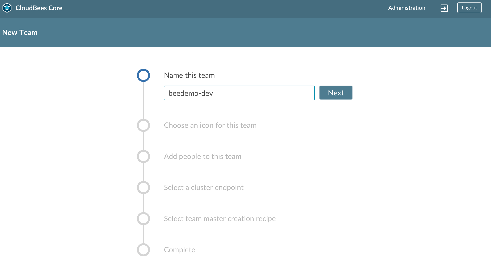
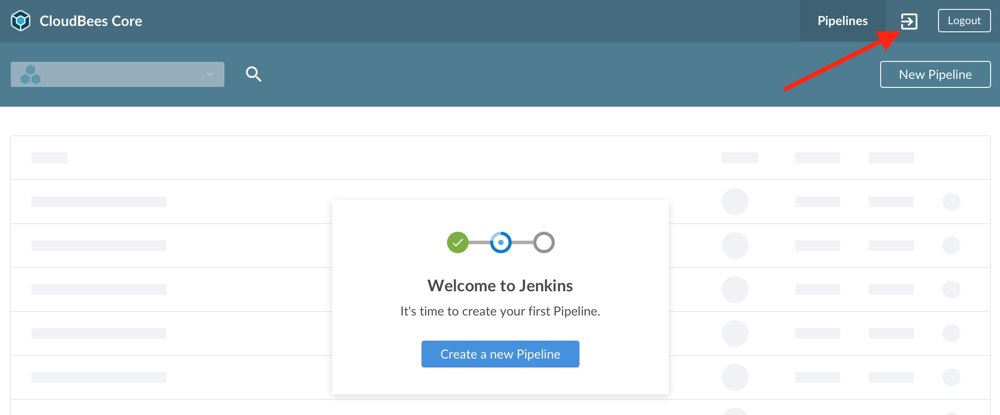

#  CloudBees Core Workshop Setup 

## CloudBees Core Team Master Set-up
Setup an environment for the labs provided in this workshop.  Ask the instructor for the URL of the server you will be using during the workshop.

Today's URL for the CloudBees Core environment is https://workshop.cb-sa.io/cjoc/

The URL for the GitHub Repository with these instructions and the labs is **https://github.com/cloudbees-days/core-rollout-flow-workshop**

### Create a CloudBees Core and CloudBees Flow Account

1. Goto to the Workshop URL provided by the instructor;
2. Click on the **create an account** link in the middle above the **Username** input.

3. Complete the **Create an account!** form (all fields are required) and click the **Create account** button;

4. You should see a **Success** page - click on **the top page** link;

5. If your instructor has informed that Slack is being used, be sure to check your email to confirm you Slack invite to cloudbees-workshops.slack.com

### Create a Team Master

Next, everyone will get their own Core Jenkins Master that we will refer to as your Team Master.

1. Log in to CloudBees Core with the account you created above at the URL provided by your instructor.
2. If not in CloudBees Team UI, click on the **Teams** link in the left menu 

3. Click on the **Create team** button in the center of your screen 

4. **Name this team** - enter a name for your team - **IMPORTANT: to ensure uniqueness, use your GitHub username** and then click **Next**;

5. **Choose an icon for this team** to help uniquely identify your team - select an icon and color for your team and then click **Next**
6. **Add people to this team** - your user will show up as a **Team Admin** and we won't be adding any additional users right now, but feel free to look around and then click **Next**
7. **Select the cluster endpoint to create the team in** - select the default value **kubernetes**
8. **Select team master creation recipe** - click on the drop-down to see the options, but select the top option: **Workshop Default** recipe;

9. Finally, click the **Create team** button. 
10. While your master is being  created (**it takes anywhere from 2-3 minutes to provision your Team Master**), move onto the next section **Create a GitHub.com user account**

## Create a GitHub.com user account
Setup a GitHub.com user account that will be used throughout this workshop. If you have an existing GitHub.com account you will be able to use it if you are comfortable using that account to create a GitHub Organization later in the workshop and creating a GitHub Personal Access Token to use throughout this workshop. If you already have a Github.com account to use then proceed to the next section.

1. Visit https://github.com/join and fill in the required fields to create a user account.
2. Select "Unlimited public repositories for free" when choosing your plan.
3. Verify your email account to ensure you account is activated.  An activated account will be **required** in the next few exercises.

## Create a GitHub Personal Access Token
The following instructions cover how to create a Github Personal Access Token that you will use within Jenkins to connect Pipelines, Multibranch Pipelines, and Github Organization Projects to your Github repositories.

1. Click on [this link to automatically select the required **Personal access token settings**](https://github.com/settings/tokens/new?scopes=repo,read:user,user:email,admin:repo_hook,admin:org_hook)
2. Click on **Generate Token**
3. As the success message says: **Make sure to copy your new personal access token now. You won’t be able to see it again!**  

## Create a GitHub Organization

Create a Github organization to use for this workshop:

1. On Github navigate to **Organizations**: https://github.com/settings/organizations (after logging in) 
2. Click on **New Organization** 

3. Fill in the **Organization Name**, **Billing Email**, and click on **Create Organization**

4. On the **Invite organization members** - just click the **Continue** button. On the next page **Enter Organization Details** either click **Submit** button or **skip this step** to finish creating the organization.

>NOTE: Even though you have to provide an email for billing, you will not be charged anything as long as you choose the free option.

## Create and Run Workshop Setup Jenkins Pipeline Template Catalog Job

The following instructions will cover the creation of a [CloudBees Core Pipeline Template Catalog](https://docs.cloudbees.com/docs/admin-resources/latest/defining-pipeline-template-catalogs/) based Pipeline job on the Team Master you created earlier to automate some additional setup for the Core labs.

1. In your browser, navigate to the Team Master you created above. 
2. If in the Blue Ocean UI, click the ***Go to classic*** button at the top of common section of Blue Ocean’s navigation bar 

3. 

## Finished Setup
You should see the following **Create a new Pipeline** screen for your new Team Master:

